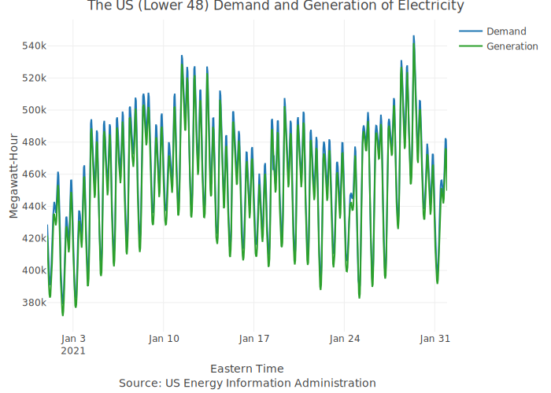

<!-- README.md is generated from README.Rmd. Please edit that file -->

```{r, include = FALSE}
knitr::opts_chunk$set(
  collapse = TRUE,
  comment = "#>"
)

`%>%` <- magrittr::`%>%`
```

# USelectricity

<!-- badges: start -->
<!-- badges: end -->

WIP...

The [US Electricity Dashboard](https://ramikrispin.github.io/USelectricity/) provides real-time tracking and forecasting for US (lower 48 states) hourly electricity demand. This project's primary goal is to demonstrate a data science project's deployment into production using open source and free tools such as R, h2o, Github Actions, Docker, and others. That includes the following components:

* Data - pulling the US hourly demand and generation of electricity data from the Energy Information Administration (EIA) API with the use of R and jq
* Forecast - generating 72 hours forecast for the total demand with the use of Generalized Linear Model (GLM) using the h2o package
* Dashboard - communicating the demand data and forecast with the use of the flexdashboard package
* Automation - the data on the dashboard is getting refresh every hour, and the forecast generated every 72 hours with the use of Github Actions and Docker


### Data

The dashboard provides an overview for the overall hourly demand and generation of electricity in the US (lower 48). 


Demand 
https://www.eia.gov/opendata/qb.php?category=3389935&sdid=EBA.US48-ALL.D.H
Net generation
https://www.eia.gov/opendata/qb.php?category=3390020&sdid=EBA.US48-ALL.NG.H

```{r include=FALSE}
load("./data/elec_df.rda")
df <- elec_df %>% 
  dplyr::filter(date_time >= lubridate::ymd_hms("2021-01-01 00:00:00", tz = "US/Eastern" ) & 
                  date_time < lubridate::ymd_hms("2021-02-01 00:00:00", tz = "US/Eastern" )) %>%
  tidyr::pivot_wider(names_from = type, values_from = series)

df$date_time_us <- lubridate::with_tz(time = df$date_time, tzone = "US/Eastern")

p <- plotly::plot_ly(data = df) %>%
  plotly::add_lines(x = ~ date_time_us,
                y = ~ demand,
                name = "Demand",
                line = list(color = "#1f77b4")) %>%
  plotly::add_lines(x = ~ date_time_us,
                y = ~ generation,
                name = "Generation",
                line = list(color = "#2ca02c")) %>%
    plotly::layout(title = "The US (Lower 48) Demand and Generation of Electricity",
                 yaxis = list(title = "Megawatt-Hour"),
                 xaxis = list(title = "Eastern Time<br> Source: US Energy Information Administration"),
                 hovermode = "compare") 

plotly::orca(p, "./figures/elec_df.svg")
  
```

